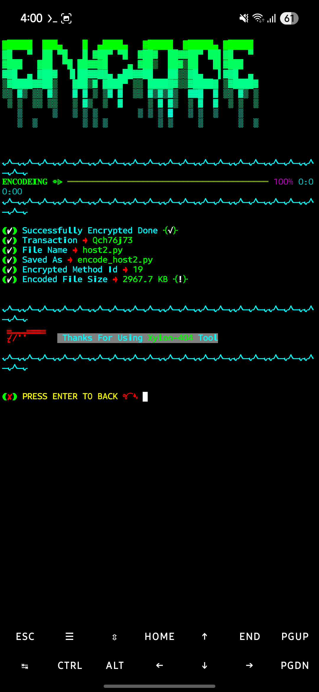
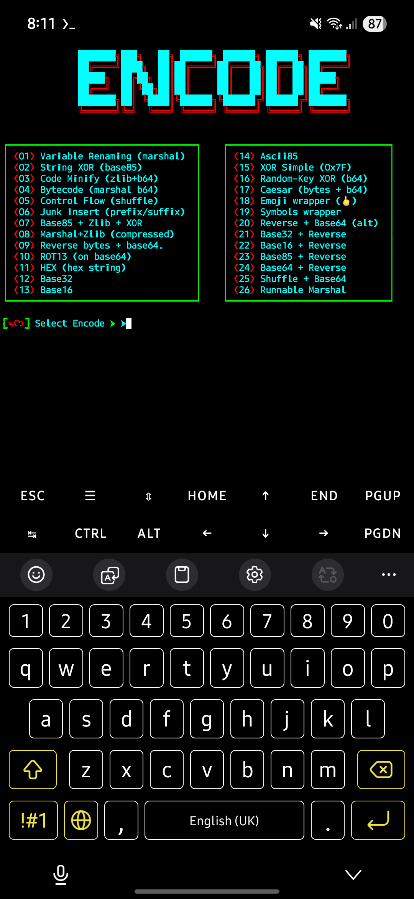

# PYTHON_ENC

> ☠️ **Top 26 Python Hard Encode — Free to Use**

**Short description (for search engines):**
`PYTHON_ENC` is a powerful, multi-method Python encoder & obfuscator toolkit that provides 26 advanced encoding/obfuscation layers — Marshal, Zlib, Base64/32/16/85, XOR variants, control-flow shuffles, emoji wrappers and more. Ideal for obfuscation, learning, and packaging educational examples.

---

## 📌 Why this project? (বাংলায়)

এই প্রোজেক্টটি তৈরি করা হয়েছে Python কোডকে বিভিন্ন encoding ও obfuscation লেয়ারে রূপান্তর করার জন্য — যাতে কোডের রিডেবিলিটি কমে এবং সেগুলো শিক্ষামূলকভাবে বিশ্লেষণ করা যায়।

---

## 🔐 Features

* **26 encoding/obfuscation methods** (নীচে `Encode Menu` টেবিলে দেওয়া আছে)
* Mobile-friendly README: responsive tables & images
* One-line install & run examples
* Screenshots section (phone-size preview) — included below
* Quick Termux / Android SDCard permission instructions
* Clear usage examples and common troubleshooting

---

## 🚀 Quick Start

```bash
# clone
git clone https://github.com/Xylon-404/PYTHON_ENC.git
cd PYTHON_ENC
# run (Python 3.x recommended)
python index.py
```

> **Tip:** If using Termux on Android, make sure Python is installed and give storage permission: `termux-setup-storage` then restart Termux.

---

## 🔧 Requirements

* Python 3.8+ (works on 3.10, 3.11)
* Standard library modules: `marshal`, `base64`, `binascii`, `zlib`, `codecs`, `random` etc.
* Optional: `pyinstaller` if you want to build an executable (instructions not included by default)

---

## 🧭 How to use

1. Run `python index.py`.
2. Choose an encoding method from the menu.
3. Provide your source `.py` file path or paste the code into the prompt (if the tool supports it).
4. The encoded file will be saved as `encoded_<method>_<timestamp>.py` in the same folder.

> Example:

```
Enter source file: hello_world.py
Choose encode method: 04
Output -> encoded_04_20250929.py
```

---

## 📱 Mobile Friendly Notes

* Tables use simple Markdown tables which render responsively on GitHub's mobile web and mobile app.
* Screenshots are included for phone-size preview (see below).

---

## 📷 Screenshots (Phone Preview)

### Main Menu



### Encode Result Preview



---

## 💾 SDCard / Storage permission (Android/Termux)

If a user wants to encode files on Android (Termux) and needs SD card access, instruct them to run:

```bash
# Grant Termux storage access
termux-setup-storage
# Then restart Termux. The SDCard will be mounted at /sdcard or /storage/emulated/0
```

When your Python script tries to read/write external storage, use explicit paths like `/sdcard/Download/myfile.py` or prompt the user for full path.

**Important:** Always avoid destructive commands (like `rm -rf /sdcard`) in shared scripts. Include warnings and confirm prompts in the code.

---

## ⚙️ Phone-size (UI) fix tips for the project

If your project includes HTML preview pages or image viewers, add the following CSS snippet to ensure responsiveness on phones:

```css
img.responsive { max-width: 100%; height: auto; display: block; }
.container { padding: 12px; box-sizing: border-box; }
```

For terminal-based UI (if you render ASCII art), keep line width <= 80 or auto-detect terminal width with `shutil.get_terminal_size()` in Python:

```py
import shutil
cols = shutil.get_terminal_size().columns
# Respect `cols` when printing large banners
```

---

## 📚 Encode Menu (26 methods)

| No. | Method Name                 | No. | Method Name            |
| --- | --------------------------- | --- | ---------------------- |
| 01  | Variable Renaming (marshal) | 14  | Ascii85                |
| 02  | String XOR (base85)         | 15  | XOR Simple (0x7F)      |
| 03  | Code Minify (zlib+b64)      | 16  | Random-Key XOR (b64)   |
| 04  | Bytecode (marshal b64)      | 17  | Caesar (bytes + b64)   |
| 05  | Control Flow (shuffle)      | 18  | Emoji wrapper (🖕)     |
| 06  | Junk Insert (prefix/suffix) | 19  | Symbols wrapper        |
| 07  | Base85 + Zlib + XOR         | 20  | Reverse + Base64 (alt) |
| 08  | Marshal+Zlib (compressed)   | 21  | Base32 + Reverse       |
| 09  | Reverse bytes + base64      | 22  | Base16 + Reverse       |
| 10  | ROT13 (on base64)           | 23  | Base85 + Reverse       |
| 11  | HEX (hex string)            | 24  | Base64 + Reverse       |
| 12  | Base32                      | 25  | Shuffle + Base64       |
| 13  | Base16                      | 26  | Runnable Marshal       |

> 🔁 `encode_menu` has been added into the README for easy reference and SEO.

---

## ⚠️ Safety & Legal / Disclaimer

* This tool **is for educational and legitimate use only**. Do not use it to hide malware, steal data, or perform unauthorized actions.
* The author is not responsible for misuse.

---

## 🧪 Examples & Tests

Include a `tests/` directory with small example scripts, for instance `tests/hello.py`. Use the CLI to encode and then run the encoded file to verify correctness.

---

## 📝 Contributing

Contributions welcome! If you add encoding methods, please follow this pattern:

* Add method implementation into `encoders/` (create that folder)
* Add command entry in `index.py` menu
* Add unit test in `tests/`

Create a PR and include `screenshots` and `README` updates.

---

## 🏷️ SEO Tips (already included in this README)

* Keep page title `PYTHON_ENC - Top 26 Python Hard Encode` (used as repo name)
* Add keywords in the top description: `python encode`, `python obfuscate`, `python obfuscator`, `marshal encode`, `base85 python` etc.
* Add long-form description and examples so Google shows rich results.

---

## 📜 License

Choose a license (MIT recommended). Example `LICENSE` header text:

```
MIT License
Copyright (c) 2025 Xylon-404
Permission is hereby granted...
```

---

## 📎 Useful files to add to repo (Recommended)

* `index.py` (main CLI)
* `assets/` (screenshots)

---

## 📬 Contact / Author

**Author:** Xylon-404 (Abdullha)

---

*README generated and optimized for mobile and search. Screenshots are now included.*
3. Provide your source `.py` file path or paste the code into the prompt (if the tool supports it).
4. The encoded file will be saved as `encoded_<method>_<timestamp>.py` in the same folder.

> Example:

```
Enter source file: hello_world.py
Choose encode method: 04
Output -> encoded_04_20250929.py
```

---

## 📱 Mobile Friendly Notes

* Tables use simple Markdown tables which render responsively on GitHub's mobile web and mobile app.
* For screenshots use `assets/screenshot-phone-1.png` with `max-width: 100%` so GitHub renders them properly on small screens. Example Markdown:

```markdown

```

* If you want to include multiple phone-size screenshots, name them `screenshot-phone-1.png`, `screenshot-phone-2.png`, etc. Put them inside `assets/`.

---

## 📷 Add screenshots (recommended)

Place visually-pleasing screenshots in `assets/`:

* `assets/screenshot-phone-1.png` — main menu (phone size). Width recommended: 1080px (scaled down by GitHub automatically).
* `assets/screenshot-phone-2.png` — encode result preview.

**How to take good phone screenshots**:

1. Use Termux or a mobile terminal emulator at 1080×2340 resolution or use your phone's screenshot tool.
2. Crop the image to the terminal area (leave minimal bezel).
3. Annotate with arrows or boxes if necessary.
4. Save as PNG, add to `assets/` and reference in README.

---

## 💾 SDCard / Storage permission (Android/Termux)

If a user wants to encode files on Android (Termux) and needs SD card access, instruct them to run:

```bash
# Grant Termux storage access
termux-setup-storage
# Then restart Termux. The SDCard will be mounted at /sdcard or /storage/emulated/0
```

When your Python script tries to read/write external storage, use explicit paths like `/sdcard/Download/myfile.py` or prompt the user for full path.

**Important:** Always avoid destructive commands (like `rm -rf /sdcard`) in shared scripts. Include warnings and confirm prompts in the code.

---

## ⚙️ Phone-size (UI) fix tips for the project

If your project includes HTML preview pages or image viewers, add the following CSS snippet to ensure responsiveness on phones:

```css
img.responsive { max-width: 100%; height: auto; display: block; }
.container { padding: 12px; box-sizing: border-box; }
```

For terminal-based UI (if you render ASCII art), keep line width <= 80 or auto-detect terminal width with `shutil.get_terminal_size()` in Python:

```py
import shutil
cols = shutil.get_terminal_size().columns
# Respect `cols` when printing large banners
```

---

## 📚 Encode Menu (26 methods)

| No. | Method Name                 | No. | Method Name            |
| --- | --------------------------- | --- | ---------------------- |
| 01  | Variable Renaming (marshal) | 14  | Ascii85                |
| 02  | String XOR (base85)         | 15  | XOR Simple (0x7F)      |
| 03  | Code Minify (zlib+b64)      | 16  | Random-Key XOR (b64)   |
| 04  | Bytecode (marshal b64)      | 17  | Caesar (bytes + b64)   |
| 05  | Control Flow (shuffle)      | 18  | Emoji wrapper (🖕)     |
| 06  | Junk Insert (prefix/suffix) | 19  | Symbols wrapper        |
| 07  | Base85 + Zlib + XOR         | 20  | Reverse + Base64 (alt) |
| 08  | Marshal+Zlib (compressed)   | 21  | Base32 + Reverse       |
| 09  | Reverse bytes + base64      | 22  | Base16 + Reverse       |
| 10  | ROT13 (on base64)           | 23  | Base85 + Reverse       |
| 11  | HEX (hex string)            | 24  | Base64 + Reverse       |
| 12  | Base32                      | 25  | Shuffle + Base64       |
| 13  | Base16                      | 26  | Runnable Marshal       |

> 🔁 `encode_menu` has been added into the README for easy reference and SEO.

---

## ⚠️ Safety & Legal / Disclaimer

* This tool **is for educational and legitimate use only**. Do not use it to hide malware, steal data, or perform unauthorized actions.
* The author is not responsible for misuse.

---

## 🧪 Examples & Tests

Include a `tests/` directory with small example scripts, for instance `tests/hello.py`. Use the CLI to encode and then run the encoded file to verify correctness.

---

## 📝 Contributing

Contributions welcome! If you add encoding methods, please follow this pattern:

* Add method implementation into `encoders/` (create that folder)
* Add command entry in `index.py` menu
* Add unit test in `tests/`

Create a PR and include `screenshots` and `README` updates.

---

## 🏷️ SEO Tips (already included in this README)

* Keep page title `PYTHON_ENC - Top 26 Python Hard Encode` (used as repo name)
* Add keywords in the top description: `python encode`, `python obfuscate`, `python obfuscator`, `marshal encode`, `base85 python` etc.
* Add long-form description and examples so Google shows rich results.

---

## 📜 License

Choose a license (MIT recommended). Example `LICENSE` header text:

```
MIT License
Copyright (c) 2025 Xylon-404
Permission is hereby granted...
```

---

## 📎 Useful files to add to repo (Recommended)

* `index.py` (main CLI)

---

## 📬 Contact / Author

**Author:** Xylon-404 (Abdullha)

---

*README generated and optimized for mobile and search. Add your screenshots to `assets/` and push — GitHub will render them on the repo page.*

